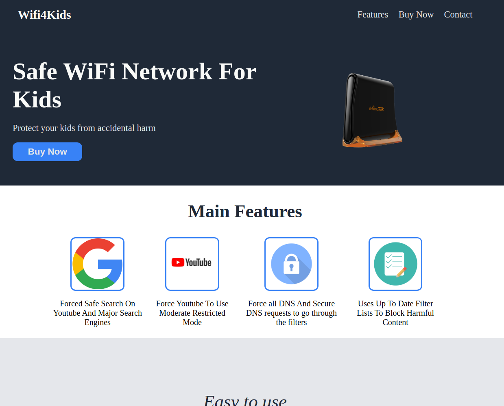

# Wifi4Kids Website

> Website built according to theodinproject specifications: https://www.theodinproject.com/paths/foundations/courses/foundations/lessons/landing-page

Wifi4Kids Home Page

## Built With

- HTML
- CSS

## Possible Improvements

- Youtube and Google use approved images
- Remove Border Boxes on features
- Use a different colour with stronger contrast to the header.
- Use a different colour with stronger contrast to the white and add more text content in your quote section.
- A better font can be used.
- Mobile Responsiveness needs work

## Live Demo

[Live Link](https://cerdtruir.github.io/WiFi4Kids/)

## Authors

👤 **Cerdtruir**

- GitHub: [@Cerdtruir](https://github.com/Cerdtruir)

## Acknowledgments

- The Odin Project
- pixabay

## 📝 License

This project is [MIT](./MIT.md) licensed.
